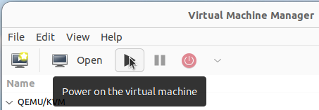

# Experiments

The contents of this directory are organized as follows.

```
.
├── charts       # scripts for plotting the charts 
├── processed    # processed (analyzed) data files
├── raw          # raw data files of the results
├── screenshots  # screenshots to illustrate the creation of VMs with the images provided
├── scripts      # scripts for installing specific kernel versions and other requirements 
├── README.md    # (this) instructions for reproducing the experiments
```

# Reproducing the Experiments

Please follow the instructions below to reproduce the experiments of the paper.

## Overview

In order to avoid significant compatibility issues between the kernel and userspace utilities, a different Ubuntu release is used for each version of the Linux kernel to be assessed.

The table below shows the environments used for the robustness tests reported in the paper.

| Operating System | Kernel Version | Kernel Release Date |
|------------------|----------------|---------------------|
| Ubuntu 15.04 | v3.19.8 | April 2015 |
| Ubuntu 19.04 | v4.20.9 | February 2019 |
| Ubuntu 22.04 | v5.19.9 | September 2022 |
| Ubuntu 25.04 | v6.14.6 | May 2025 |

## Preparing the Environment

To support reproducibility, we provide two methods for setting up the experimental environments.

The first method consists of using pre-prepared virtual machines. The second method is based on manually installing the operating system (including specific kernel versions) and all other requirements.

Please use the method that is most suitable for your needs.

### Method 1: Use Pre-Built Virtual Machines

The easiest way to reproduce the experiments is to use pre-built virtual machines (VMs). For this purpose, we provide QCOW2 images that can be used through QUEMU (KVM), as well as instructions for use them.

#### Installing the KVM Hypervisor

If you do not have KVM installed, use the commands below to proceed with the installation:
```
sudo apt update
sudo apt upgrade
sudo apt install qemu-kvm libvirt-daemon-system libvirt-clients bridge-utils virt-manager
sudo adduser $USER libvirt
sudo adduser $USER kvm
sudo reboot
```

After the system reboots, run the Virtual Machine Manager with the following command:
```
virt-manager
```

#### Downloading images

The images are available in the following Zenodo repository: [https://doi.org/10.5281/zenodo.16883930](https://doi.org/10.5281/zenodo.16883930)

The table below lists all currently available images.

| Operating System | Image (QCOW2) |
|------------------|---------------------|
| Ubuntu 19.04 | ubuntu19.04-kernel4.20.9.zip |
| Ubuntu 22.04 | ubuntu22.04-kernel5.19.9.zip |
| Ubuntu 25.04 | ubuntu25.04-kernel6.14.6.zip |

> Note: We are facing issues when preparing the Ubuntu 15.04 image. There are compatibility issues with modern hypervisors, as it is a very old (deprecated) system. However, you can still perform a baremetal installation by following the instructions in Method 2.

Download the images (.zip files). Then, extract the .zip files in order to move the .qcow2 images to the default QUEMU/libvirt directory:
```
sudo apt install unzip
sudo unzip ubuntu19.04-kernel4.20.9.zip -d /var/lib/libvirt/images/
sudo unzip ubuntu22.04-kernel5.19.9.zip -d /var/lib/libvirt/images/
sudo unzip ubuntu25.04-kernel6.14.6.zip -d /var/lib/libvirt/images/
```

#### Creating VMs

> Important: The following steps should be repeated for each version of Ubuntu/kernel.

Click on the create button:

</img>

Select the option "Import existing disk image":

</img>

Then, select an image and choose the operating system:

</img>

Choose memory and CPU settings:

</img>

Click on Finish:

</img>

Finally, power on the VM:

</img>

To access the VMs, use the following credentials:
- Username: user
- Password: issre2025

Once the VM is running and you have access to it, you can go to the "Running Tests" section.

### Method 2: Perform a Full Installation

| Operating System | Download link (ISO) |
|------------------|---------------------|
| Ubuntu 15.04 | [link](https://old-releases.ubuntu.com/releases/15.04/) |
| Ubuntu 19.04 | [link](https://old-releases.ubuntu.com/releases/19.04/) |
| Ubuntu 22.04 | [link](https://releases.ubuntu.com/22.04/) |
| Ubuntu 25.04 | [link](https://releases.ubuntu.com/25.04/) |

> Important: The following steps should be repeated for each version of Ubuntu/kernel.

#### OS installation

Please go ahead and install the most appropriate Ubuntu release for the kernel version to be used in the current test scenario (see the table above).

After completing the installation, download or clone this repository on the newly installed system and follow the instructions from the very next step.

#### Installation of the specific kernel version

> Note: Ensure that you are in the `experiments/` directory (all commands and scripts assume this).

Install the specific kernel version to be used through the appropriate script.

For example, on Ubuntu 15.04, use the `install-ubuntu_15.04_part_1.sh` script to install kernel version 3:
```
sudo ./scripts/install-ubuntu_15.04_part_1.sh
```

After completing the installation procedure, the system will automatically reboot.

#### Requirements installation

> Note: Ensure that you are in the `experiments/` directory (all commands and scripts assume this).

Install the appropriate version of Python and OvS utilities according to the Ubuntu release you are using.

For example, for Ubuntu 15.04, run the following command:
```
sudo ./scripts/install-ubuntu_15.04_part_2.sh
```

## Running Tests

> Important: The following steps should be repeated for each version of Ubuntu/kernel.

All test cases have been previously generated and are contained in the repository ([../src/input/test_cases/](../src/input/test_cases/)). Therefore, you only need to run the tests for each Generic Netlink family implemented by Open vSwitch.

From the `experiments/` directory, you can run all tests using the following command:
```
sudo ./scripts/run_all_tests.sh
```

Alternatively, you can also perform the tests for each Generic Netlink family individually.

For this, go to the source code directory:
```
cd ../src
```

Then, use the following syntax:
```
sudo python3 main.py -f <family>
```

In the case of the osv_datapath family, for example, you can use the command below:
```
sudo python3 main.py -f ovs_datapath
```

> Note: In any case, the results are stored in the [../src/output/](../src/output/) directory.


## Failure Analysis

After performing the experiments on all kernel versions considered in the paper, it is necessary to (manually) analyze the results. For this, please refer to sections IV-B and IV-C of the paper.

Both the raw data and the analyzed results reported in the paper are available in the [raw/](raw/) and [processed/](processed/) repositories, respectively.

> Note: When performing your data analysis, please only modify the CSV files already existing in the `processed/` directory. This will ensure that the data structure and file naming convention remain consistent, allowing the plotting scripts to continue working properly. We plan to automate the analysis process in future work.

## Plotting Charts

### Preparing the virtual environment

Go to the [charts/](charts/) directory:
```
cd charts/
```

Then, run the following sequence of commands to prepare the virtual environment properly:

```
virtualenv ovs-env
source ovs-env/bin/activate
pip install -r requirements.txt
```

### Plot

Now you can plot all charts by running the script:
```
./plot_all_charts.sh
```

Alternatively, you can plot each chart individually:
```
python3 plot_heatmap_failures_across_kernels.py      # plot Figure 4
python3 plot_failure_rates_across_kernel_versions.py # plot Figure 5
python3 plot_failure_count_by_rule_and_family.py     # plot Figure 6
```

> Note: In both cases, the charts will be located in the `PDF/` directory.

Once you are finished, deactivate the virtual environment:
```
deactivate
```